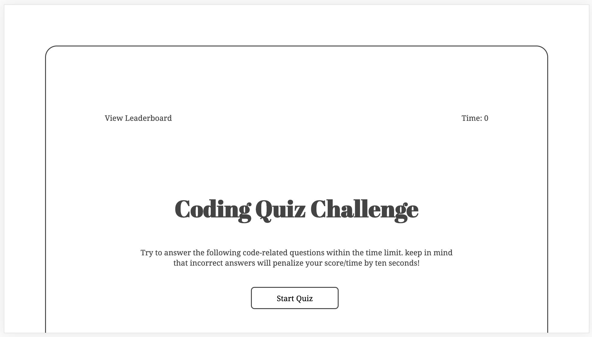
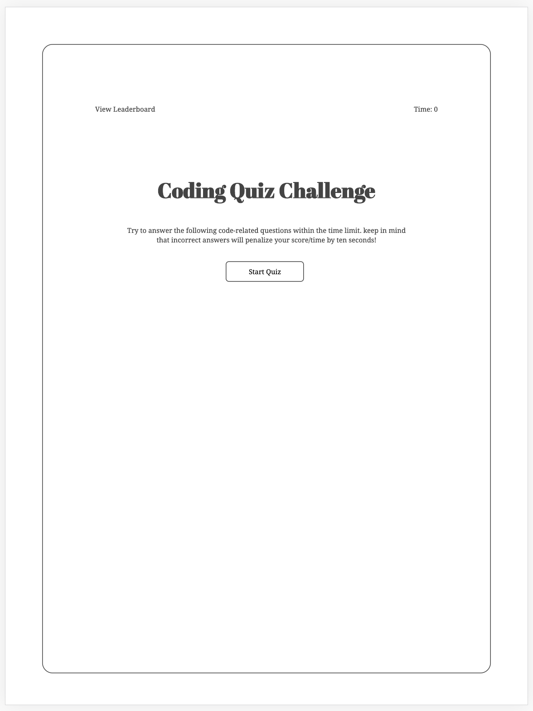
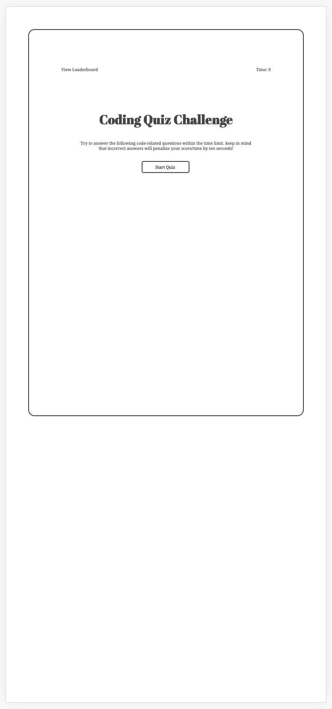
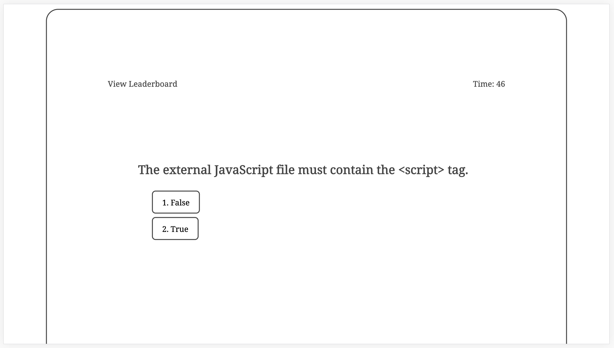
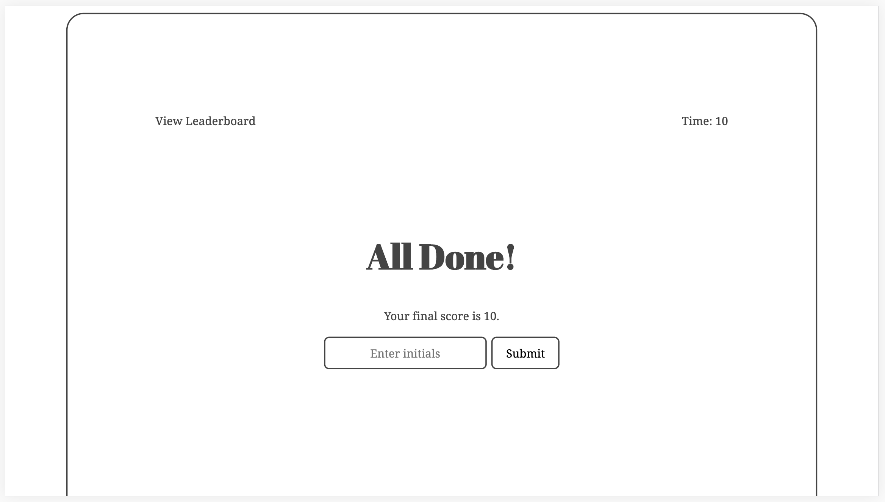
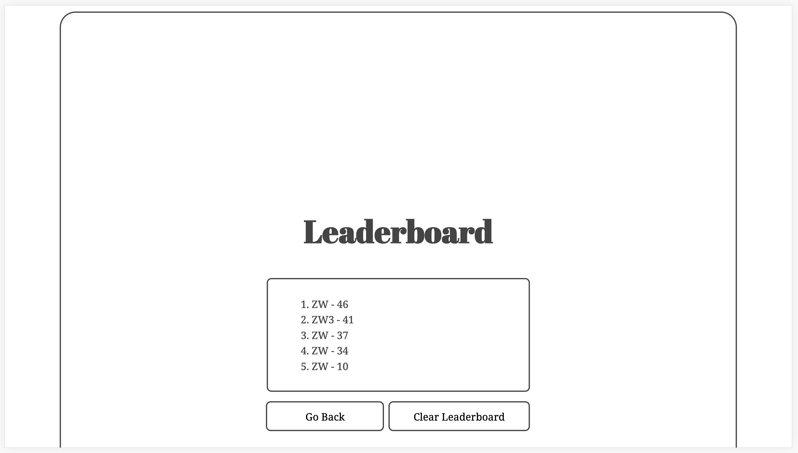

# Code Quiz

## Requirements

Build a timed code quiz with multiple-choice questions. This app will run in the browser and feature dynamically updated HTML and CSS powered by your JavaScript code. It will also feature a clean and polished user interface and be responsive, ensuring that it adapts to multiple screen sizes.

* User clicks start button to start the quiz and timer starts

* Once user answers a question, the next question will show up unless it reaches the end of the quiz

* If user answers correctly, pops "Correct!" and a "Ding" sound

* If user answers incorrectly, pops "Wrong!" and a "Buzz" sound, and time is subtracted by 10 seconds from timer

* Once all questions are answered or the timer reaches 0, the game is over

* User can save initials and score to be shown on Leaderboard

## Website Walk-Through

The following images demonstrates the website on different screen sizes.

* Desktop (width="1920")

* Tablet (width="768")

* Phone (width="375")

The following images demonstrates website functionality.

## Files

* `index.html`

* `script.js`

* `style.css`

* `correct_answer.mp3`

* `wrong_answer.mp3`

* `start_page_desktop.png`

* `start_page_tablet.png`

* `start_page_mobile.png`

* `question_page.png`

* `final_score_page.png`

* `leaderboard_page.png`

* `README.md`

## Deployed Link
https://zhouyiartemiswang.github.io/code_quiz/